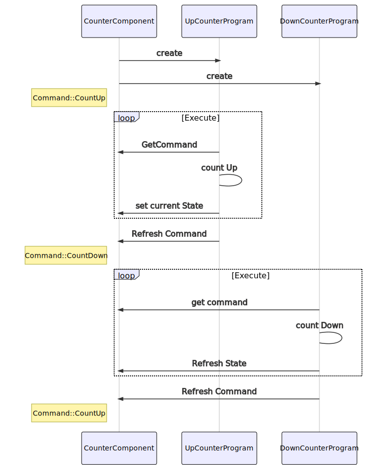

# Program Component Interaction 
This example shows how data can be sent from a program to a component.
The program can also receive data by calling public getter methods of the component.

The *UpCounterProgram* and *DownCounterProgram* access the *CounterComponent* with these methods.
They use the *CounterComponent.GetCommand()* to receive an *enum* of *Commands* and a *setProgress()* method to inform the component of the state of the program.
Once the program has received a command it will continue to execute this command, and - when finished - execute the *CounterComponent.RefreshState()* method which will then initiate a state change.

<!-- Original mermaid source, for when github decides to allow it.
```mermaid
sequenceDiagram
    participant CounterComponent
    participant UpCounterProgram
    participant DownCounterProgram
    CounterComponent->>DownCounterProgram: create
 CounterComponent->>DownCounterProgram: create
Note left of CounterComponent: Command::CountUp
    loop Execute
        UpCounterProgram->>CounterComponent: GetCommand
       
        UpCounterProgram->UpCounterProgram: count Up   
        UpCounterProgram->>CounterComponent: set current State 
 end
UpCounterProgram->>CounterComponent: Refresh Command 
Note left of CounterComponent: Command::CountDown
loop Execute
        DownCounterProgram->>CounterComponent: get command 
        DownCounterProgram->DownCounterProgram: count Down
        DownCounterProgram->>CounterComponent: Refresh State 
    end

DownCounterProgram->>CounterComponent: Refresh Command 
Note left of CounterComponent: Command::CountUp
```
-->

## Example details
|Description | Value |
|------------ |-----------|
|Controller | AXC F 2152 |
|FW | 2020.0 LTS or later |
|SDK | 2020.0 LTS or later |
|PLCnext Engineer | 2021.0 LTS or later |

## Preconditions

- PLCnext Engineer is installed
- PLCnext Technology SDK for C++ is installed

## Start-up instructions

1. Create one instance of each Program
2. Start the PLCnext Control
3. Login with PLCnext Engineer Debug or SSH.
4. Check progress

You can now see the counters going up and down in the *PLCnext - Port List* window in PLCnext Engineer. The value of the `Down_Counter` port on the `DownCounterProgram` instance will decrement from 255 to zero, then the value of the `UP_Counter` port on the `UpCounterProgram` instance will increment from zero to 255.

You can see also the progress in the *Output.log* file with `tail -f /opt/plcnext/logs/Output.log`.
